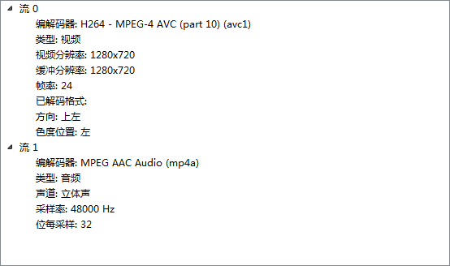
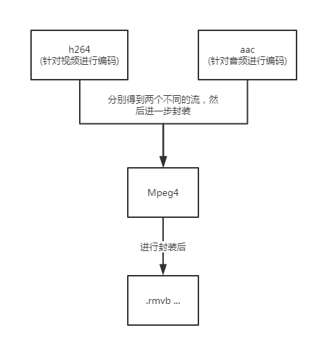
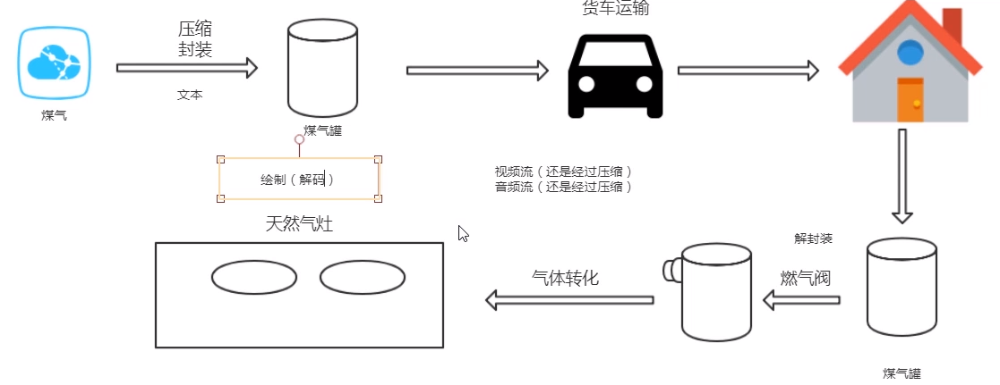
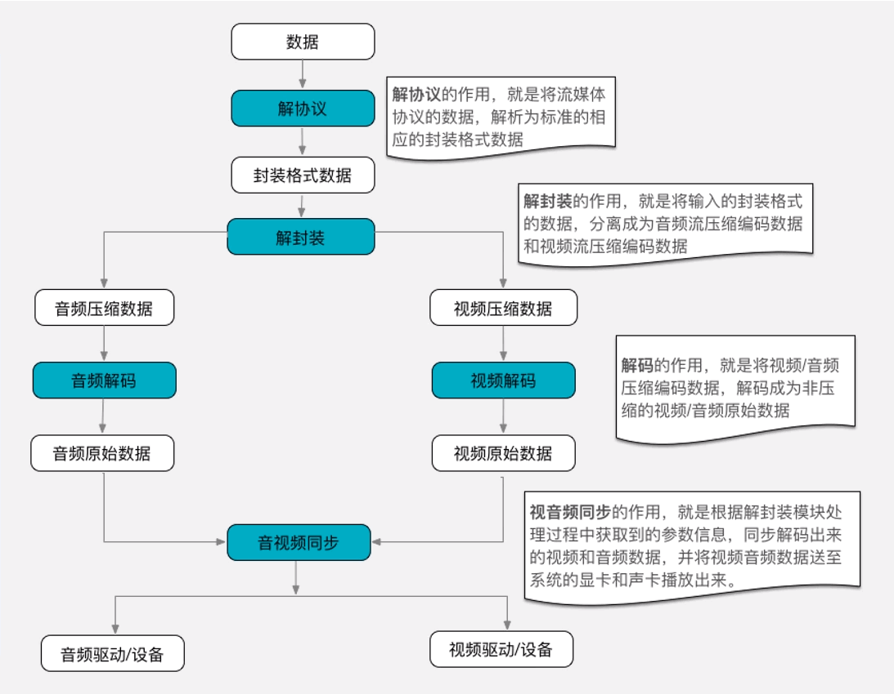
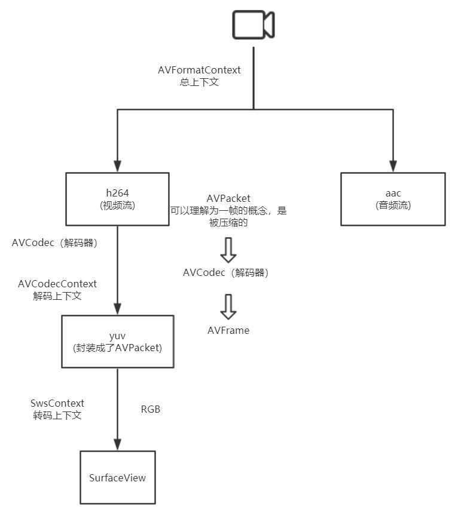
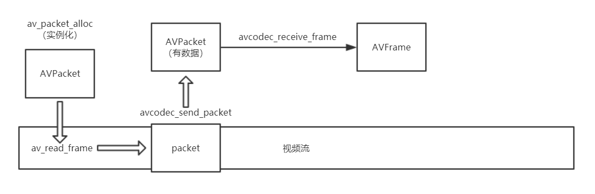
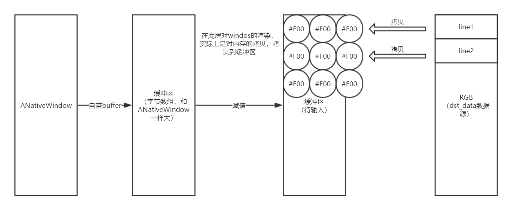

## 音视频解码及同步处理

### 前言

查看一个视频的编码信息



- 流0：视频流。

  H264：表示视频是由H264来编码

  MPEG-4：表示视频的封装格式

- 流1：音频流。



### 视频的封装格式

平时我们打开电脑中自己存电影的目录的话，一般都会如下图所示，一大堆五花八门的电影。


因为下载的来源不同，这些电影文件有不同的格式，用不同的后缀表示：avi，rmvb，mp4，flv，mkv等等（当然也使用不同的图标）。在这里需要注意的是，这些格式代表的是封装格式。何为封装格式？就是把视频数据和音频数据打包成一个文件的规范。仅仅靠看文件的后缀，很难能看出具体使用了什么视音频编码标准。总的来说，不同的封装格式之间差距不大，各有优劣。

注：有些封装格式支持的视音频编码标准十分广泛，应该算比较优秀的封装格式，比如MKV；而有些封装格式支持的视音频编码标准很少，应该属于落后的封装格式，比如RMVB。

### 视频编码到播放流程

根据生活例子





### 视频播放器原理

音视频技术主要包含以下几点：封装技术，视频压缩编码技术以及音频压缩编码技术。如果考虑到网络传输的话，还包括流媒体协议技术。

视频播放器的源代码详细解析（Media Player Classic - HC，Mplayer，FFplay，XBMC）可以参考系列文章：

Media Player Classic：Media Player Classic - HC源代码分析 1：整体结构[系列文章]

Mplayer：MPlayer源代码分析

FFplay： FFplay源代码分析：整体流程图

XBMC： XBMC源代码分析 1：整体结构以及编译方法[系列文章]

在这里不细说了，仅简要说明一下视频播放器的原理。

视频播放器播放一个互联网上的视频文件，需要经过以下几个步骤：解协议，解封装，解码视音频，视音频同步。如果播放本地文件则不需要解协议，为以下几个步骤：解封装，解码视音频，视音频同步。

解协议的作用，就是将流媒体协议的数据，解析为标准的相应的封装格式数据。视音频在网络上传播的时候，常常采用各种流媒体协议，例如HTTP，RTMP，或是MMS等等。这些协议在传输视音频数据的同时，也会传输一些信令数据。这些信令数据包括对播放的控制（播放，暂停，停止），或者对网络状态的描述等。解协议的过程中会去除掉信令数据而只保留视音频数据。例如，采用RTMP协议传输的数据，经过解协议操作后，输出FLV格式的数据。

解封装的作用，就是将输入的封装格式的数据，分离成为音频流压缩编码数据和视频流压缩编码数据。封装格式种类很多，例如MP4，MKV，RMVB，TS，FLV，AVI等等，它的作用就是将已经压缩编码的视频数据和音频数据按照一定的格式放到一起。例如，FLV格式的数据，经过解封装操作后，输出H.264编码的视频码流和AAC编码的音频码流。

解码的作用，就是将视频/音频压缩编码数据，解码成为非压缩的视频/音频原始数据。音频的压缩编码标准包含AAC，MP3，AC-3等等，视频的压缩编码标准则包含H.264，MPEG2，VC-1等等。解码是整个系统中最重要也是最复杂的一个环节。通过解码，压缩编码的视频数据输出成为非压缩的颜色数据，例如YUV420P，RGB等等；压缩编码的音频数据输出成为非压缩的音频抽样数据，例如PCM数据。

视音频同步的作用，就是根据解封装模块处理过程中获取到的参数信息，同步解码出来的视频和音频数据，并将视频音频数据送至系统的显卡和声卡播放出来。

### 使用FFmpeg实现视频播放

写一个jni接口类，来控制底层视频的播放

```java
/**
 * 集合着jni接口和监听SurfaceView的创建过程（SurfaceHolder.Callback）
 */
public class FFmpegPlayer implements SurfaceHolder.Callback{
    static {
        System.loadLibrary("native-lib");
    }
    private SurfaceHolder surfaceHolder;
    
    /**
     * SurfaceView设置方法
     * @param surfaceView SurfaceView对象
     */
    public void setSurfaceView(SurfaceView surfaceView) {
        if (null != this.surfaceHolder) {
            this.surfaceHolder.removeCallback(this);
        }
        this.surfaceHolder = surfaceView.getHolder();
        // 设置监听
        this.surfaceHolder.addCallback(this);

    }
    public void start(final String path) {
        new Thread(new Runnable() {
            @Override
            public void run() {
                native_start(path, surfaceHolder.getSurface());
            }
        }).start();
    }
    /**
     * native函数，播放视频
     * @param path 视频本地路径
     * @param surface Surface对象
     */
    public  native void native_start(String path, Surface surface);
    @Override
    public void surfaceCreated(SurfaceHolder surfaceHolder) {
        this.surfaceHolder = surfaceHolder;
    }

    @Override
    public void surfaceChanged(SurfaceHolder surfaceHolder, int i, int i1, int i2) {   
    }

    @Override
    public void surfaceDestroyed(SurfaceHolder surfaceHolder) {
    }
}
```

由于是将播放绘制的操作交给了NDK，就需要传递播放相关的参数，路径和Surface。因为在native层是没有SurfaceView的，但是有Surface，所以需要监听SurfaceView的创建过程，通过SurfaceHolder获得Surface对象并传给native层。

在native_start函数中开始使用FFmpeg来进行视频播放。



**初始化**

```c++
// 初始化FFmpeg的网络模块
avformat_network_init();

// 总上下文AVFormatContext
AVFormatContext *avFormatContext = avformat_alloc_context();

AVDictionary *param = NULL;
// 设置超时时间，单位是微秒，1秒=1000000微秒
av_dict_set(&param, "timeout", "3000000", 0);
// 打开视频文件
// 有个int返回值，0：返回成功；非0：返回失败
int ret = avformat_open_input(&avFormatContext, path, NULL, &param);
if (ret) {
    return;
}
```

> 注意：在FFmpeg中int返回值 0 都是表示成功，非0表示失败

**寻找视频流**

```c++
int video_stream_idx = -1;
// 通知FFmpeg将流解析出来
avformat_find_stream_info(avFormatContext, NULL);
// 遍历视频文件所有的流，找出视频流的索引
for (int i = 0; i < avFormatContext->nb_streams; ++i) {
    // AVMEDIA_TYPE_VIDEO：视频流
    // AVMEDIA_TYPE_AUDIO：音频流
    // AVMEDIA_TYPE_SUBTITLE：字幕流
    if (avFormatContext->streams[i]->codecpar->codec_type == AVMEDIA_TYPE_VIDEO) {
        // 如果这个流的类型是视频流，记录视频流的索引
        video_stream_idx = i;
        break;
    }
}

// 获取视频流的解码参数
// AVCodecParameters里面有对当前视频的宽度，高度，延迟时间等的描述
AVCodecParameters *codecpar = avFormatContext->streams[video_stream_idx]->codecpar;
```

**获取解码器并打开**

```c++
// 获取解码器，是与视频的id一一对应的
AVCodec *avCodec = avcodec_find_decoder(codecpar->codec_id);
// 解码器的上下文AVCodecContext
AVCodecContext *avCodecContext = avcodec_alloc_context3(avCodec);
// 将获取视频流的解码参数传入解码器上下文
avcodec_parameters_to_context(avCodecContext, codecpar);
// 打开解码器
avcodec_open2(avCodecContext, avCodec, NULL);
```

**解码**



```c++
// 在解码过程中是看不到相关yuv的数据的，因为被封装成了AVPacket，所以要读取yuv数据必须从AVPacket中找
// 实例化AVPacket
AVPacket *avPacket = av_packet_alloc();
// 实例化AVFrame
AVFrame *avFrame = av_frame_alloc();

// av_read_frame 从视频流中读取数据包到AVPacket中
// 返回值0：读取成功；< 0：读取错误或者到文件末尾
while (av_read_frame(avFormatContext, avPacket) >= 0) {
    // 取出packet
    avcodec_send_packet(avCodecContext, avPacket);
    // 转换为frame
    ret = avcodec_receive_frame(avCodecContext, avFrame);
}
```

```c++
/**
 *  @return 0 代表成功, 否则返回错误码，有以下几个:
 *      AVERROR(EAGAIN ): 读取的信息会维持一个队列，如果队列超过了FFmpeg内部维持的最大大小，则必须先通过 avcodec_receive_frame 取出读取的信息
 *      AVERROR_EOF: 解码被全部刷新完了，并且没有新的 packet 传入进来
 *      AVERROR(EINVAL): 解码器不能打开（它是一个编码器，或者它需要刷新）
 *      AVERROR(ENOMEM): 不能打开内部的队列
 *      other errors: legitimate decoding errors
 */
int avcodec_send_packet(AVCodecContext *avctx, const AVPacket *avpkt);
```

**绘制**

```c++
// 转换上下文
// avCodecContext->pix_fmt当前视频的编码格式
// flags：转换方式：
//  重视速度：fast_bilinear, point
//  重视质量：gauss, bilinear
//  重视锐度：cubic, spline, lanczos
//  得到一个转码上下文SwsContext
SwsContext *swsContext = sws_getContext(avCodecContext->width, avCodecContext->height,
                                        avCodecContext->pix_fmt,
                                        avCodecContext->width, avCodecContext->height,
                                        AV_PIX_FMT_RGBA, SWS_BILINEAR,
                                        0, 0, 0);

// 接收的容器
uint8_t *dst_data[0];
// 每一行的首地址
int dst_linesize[0];
// 声明一个图片
av_image_alloc(dst_data, dst_linesize, avCodecContext->width, avCodecContext->height,
               AV_PIX_FMT_RGBA, 1);

ANativeWindow *nativeWindow = ANativeWindow_fromSurface(env, surface);
// 设置缓冲区
ANativeWindow_setBuffersGeometry(nativeWindow, avCodecContext->width, 
                                 avCodecContext->height,
                                 WINDOW_FORMAT_RGBA_8888);
ANativeWindow_Buffer outBuffer;

while (av_read_frame(avFormatContext, avPacket) >= 0) {
    ...
    // 将yuv的一帧frame转换为rgb
    sws_scale(swsContext, avFrame->data, avFrame->linesize, 0, avFrame->height, dst_data,
              dst_linesize);
    
    // 渲染
    // 在底层渲染只能通过ANativeWindow来进行渲染
    
    // 锁住NativeWindow
    ANativeWindow_lock(nativeWindow, &outBuffer, NULL);
    
    // ------------缓冲区渲染------------
    uint8_t *firstWindow = static_cast<uint8_t *>(outBuffer.bits);
    // 输入源（rgb）
    uint8_t *src_data = dst_data[0];
    // 拿到一行有多少个字节 RGBA
    int dstStride = outBuffer.stride * 4;
    int src_linesize = dst_linesize[0];
    for (int i = 0; i < outBuffer.height; ++i) {
        // 内存拷贝，来进行渲染，一行一行拷贝
        memcpy(firstWindow + i * dstStride, src_data + i * src_linesize, dstStride);
    }
    
    // 解锁NativeWindow
    ANativeWindow_unlockAndPost(nativeWindow);
    usleep(1000 * 16);
}

```
渲染机制

