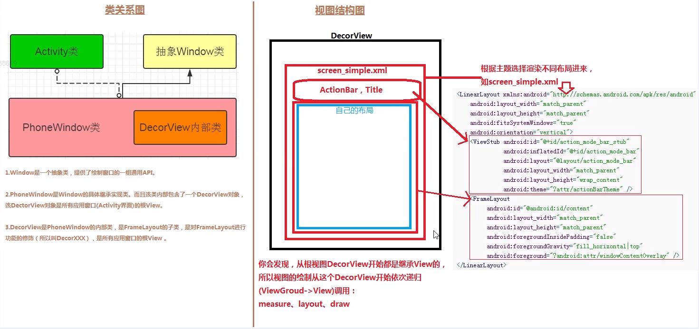

## UI绘制流程及原理

### View是如何被添加到屏幕窗口上

1. 创建顶层布局容器DecorView
2. 在顶层布局中加载基础布局ViewGroup
3. 将ContentView添加到基础布局中的FrameLayout中

#### 源码分析

通常一个Activity加载一个View时，在onCreate方法中调用setContentView方法，传入一个布局资源id。查看源码得知，在Activity类中，又调用了`getWindow().setContentView(layoutResID);`。

##### 什么是Window？

```
/**
 * <p>The only existing implementation of this abstract class is
 * android.view.PhoneWindow, which you should instantiate when needing a
 * Window.
 */
public abstract class Window {...}
```

源码注释表明：Window是一个抽象类，它仅有一个实现类是android.view.PhoneWindow。

##### PhoneWindow

进入PhoneWindow类，找到setContentView()方法

```
@Override
public void setContentView(int layoutResID) {
    // Note: FEATURE_CONTENT_TRANSITIONS may be set in the process of installing the window
    // decor, when theme attributes and the like are crystalized. Do not check the feature
    // before this happens.
    if (mContentParent == null) {
    	// 1. 创建顶层窗口DecorView；在顶层View中add一个基础容器
        installDecor();
    } else if (!hasFeature(FEATURE_CONTENT_TRANSITIONS)) {
        mContentParent.removeAllViews();
    }

    if (hasFeature(FEATURE_CONTENT_TRANSITIONS)) {
        final Scene newScene = Scene.getSceneForLayout(mContentParent, layoutResID,
                getContext());
        transitionTo(newScene);
    } else {
    	// 2. 通过LayoutInflater一个对象来解析传入的布局资源ID，加载到mContentParent中
        mLayoutInflater.inflate(layoutResID, mContentParent);
    }
    ...省略...
}
```

##### installDecor方法

```
private void installDecor() {
	// 1.
	if (mDecor == null) {
		// 在布局资源加载的过程中首先创建了DecorView的对象
		// DecorView是一个容器，继承于FrameLayout
		mDecor = generateDecor(-1);
	}
	// 2.
	if (mContentParent == null) {
		mContentParent = generateLayout(mDecor);
		...省略...
	}
}

protected DecorView generateDecor(int featureId) {
    ...省略...
    //主要new一个DecorView对象并返回
    return new DecorView(context, featureId, this, getAttributes());
}

protected ViewGroup generateLayout(DecorView decor) {
	// 1. 一系列if判断，根据系统主题属性，设置相关特性
	if (a.getBoolean(R.styleable.Window_windowNoTitle, false)) {
		requestFeature(FEATURE_NO_TITLE);
	}
	...省略...
	
	// Inflate the window decor. 解析窗口View
	int layoutResource;
	int features = getLocalFeatures();
	// 2. 一系列if判断，根据features值，对layoutResource赋值不同的窗口View布局资源
	if ((features & (1 << FEATURE_SWIPE_TO_DISMISS)) != 0) {
		// screen_swipe_dismiss 等为系统源码内的布局资源
		layoutResource = R.layout.screen_swipe_dismiss;
	}
	...省略...

	// 3. 解析布局资源， 并add到DecorView中
	mDecor.onResourcesLoaded(mLayoutInflater, layoutResource);
	
	// 4. find contentParent
	// ID_ANDROID_CONTENT = com.android.internal.R.id.content
	// 它是主容器布局的ID，而且是一定存在的
	ViewGroup contentParent = (ViewGroup)findViewById(ID_ANDROID_CONTENT);
	...省略...
	return contentParent;
}
```

#### 总结



1. 系统会创建一个顶层布局容器DecorView，它是一个ViewGroup容器，继承FrameLayout，是PhoneWindow持有的一个实例，是所有应用窗口的顶层View，在系统内部进行初始化。
2. 当DecorView初始化完成后，系统会根据不同的主题特性去加载不同的基础容器。这个基础容器中，必定存在一个ID为com.android.internal.R.id.content的FrameLayout容器。
3. 当setContentView方法传入的自己的布局资源ID，经过解析后add到FrameLayout中。

### View的绘制流程

1、绘制入口

```
ActivityThread.handleResumeActivity
-->WindowManagerImpl.addView(decroView, layoutParmars);
-->WindowManagerGlobal.addView()
```

2、绘制的类及方法

```
ViewRootImpl.setView(decroView, layoutParmars, parentView)
-->ViewRootImpl.requestLayout()-->scheduleTraversals()-->doTraversal()
-->performTraversals
```

3、绘制三大步骤

```
测量：ViewRootImpl.performMeasure
布局：ViewRootImpl.performLayout
绘制：ViewRootImpl.performDraw
```

#### 源码分析

首先进入ActivityThread类，查看 H 内部类，H类继承Handler类，是主线程处理消息对象。

```
private class H extends Handler {
	public void handleMessage(Message msg) {
		switch (msg.what) {
			// 启动Activity
			case LAUNCH_ACTIVITY: {
				...
				handleLaunchActivity(r, null, "LAUNCH_ACTIVITY");
				...
			} break;
			
			...省略...
		}
}

private void handleLaunchActivity(ActivityClientRecord r, Intent customIntent, String reason) {
	// 1. 获取启动的Activity对象
	Activity a = performLaunchActivity(r, customIntent);
	
	if (a != null) {
		handleResumeActivity(r.token, false, r.isForward,
                    !r.activity.mFinished && !r.startsNotResumed, r.lastProcessedSeq, reason);
	}
	
	...省略...
}

final void handleResumeActivity(IBinder token, boolean clearHide, boolean isForward, boolean reallyResume, int seq, String reason) {
	
	// 回调Activity的生命周期中的onResume()方法
	r = performResumeActivity(token, clearHide, reason);
	if (r != null) {
        if (r.window == null && !a.mFinished && willBeVisible) {
            r.window = r.activity.getWindow();
            
            // 获取顶层窗口DecorView
            View decor = r.window.getDecorView();
            decor.setVisibility(View.INVISIBLE);
            
            // 跟踪代码得知：
            // 1、ViewManager是一个接口
            // 2、在Activity中通过mWindow.getWindowManager()获取WindoManager对象，WindoManager继承于ViewManager
            // 3、在Window类中，通过((WindowManagerImpl)wm).createLocalWindowManager(this)来进行实例化
            // 4、进入WindowManagerImpl类查看源码
            ViewManager wm = a.getWindowManager();
            // 初始换窗口布局属性对象
            WindowManager.LayoutParams l = r.window.getAttributes();
            ...
            if (a.mVisibleFromClient) {
                if (!a.mWindowAdded) {
                    a.mWindowAdded = true;
                    // 将顶层窗口DecorView add到
                    wm.addView(decor, l);
                } else {
                    a.onWindowAttributesChanged(l);
                }
            }
        } else if (!willBeVisible) {
            if (localLOGV) Slog.v(
                TAG, "Launch " + r + " mStartedActivity set");
            r.hideForNow = true;
        }
    }
}
```

##### WindowManagerImpl

```
@Override
public void addView(@NonNull View view, @NonNull ViewGroup.LayoutParams params) {
	applyDefaultToken(params);
	// 进入WindowManagerGlobal类查看addView方法
	mGlobal.addView(view, params, mContext.getDisplay(), mParentWindow);
}
```

##### WindowManagerGlobal

```
public void addView(View view, ViewGroup.LayoutParams params, Display display, Window parentWindow) {
    ...省略...

    ViewRootImpl root;
    View panelParentView = null;

    synchronized (mLock) {

        // 实例化 ViewRootImpl
        root = new ViewRootImpl(view.getContext(), display);
        view.setLayoutParams(wparams);

        // 将view、root、wparams加到集合里
        mViews.add(view);
        mRoots.add(root);
        mParams.add(wparams);
        // do this last because it fires off messages to start doing things
        try {
        	// 通过 ViewRootImpl 中 setView 方法进行关联
        	// 进入 ViewRootImpl 查看 setView 方法
            root.setView(view, wparams, panelParentView);
        } catch (RuntimeException e) {
            // BadTokenException or InvalidDisplayException, clean up.
            if (index >= 0) {
                removeViewLocked(index, true);
            }
            throw e;
        }
    }
    ...省略...
}
```

##### ViewRootImpl

```
public void setView(View view, WindowManager.LayoutParams attrs, View panelParentView) {
    synchronized (this) {
        if (mView == null) {
            ...省略...

            // Schedule the first layout -before- adding to the window
            // manager, to make sure we do the relayout before receiving
            // any other events from the system.
            requestLayout();

            ...省略...
        }
    }
}

@Override
public void requestLayout() {
    if (!mHandlingLayoutInLayoutRequest) {
    	// 检查当前绘制过程是否在主线程中执行
        checkThread();
        mLayoutRequested = true;
        // 执行某些操作...
        scheduleTraversals();
    }
}

// 线程
final class TraversalRunnable implements Runnable {
	@Override
	public void run() {
		doTraversal();
	}
}
final TraversalRunnable mTraversalRunnable = new TraversalRunnable();

void scheduleTraversals() {
    if (!mTraversalScheduled) {
        mTraversalScheduled = true;
        mTraversalBarrier = mHandler.getLooper().getQueue().postSyncBarrier();
        
        // 会调用TraversalRunnable线程的run()方法，会执行 doTraversal() 方法。
        mChoreographer.postCallback(
                Choreographer.CALLBACK_TRAVERSAL, mTraversalRunnable, null);
        if (!mUnbufferedInputDispatch) {
            scheduleConsumeBatchedInput();
        }
        notifyRendererOfFramePending();
        pokeDrawLockIfNeeded();
    }
}

void doTraversal() {
    if (mTraversalScheduled) {
        // 主要方法
        performTraversals();
    }
}

// 进行View的绘制流程三大步
private void performTraversals() {
	...省略...
	
	// 1. 测量
	performMeasure(childWidthMeasureSpec, childHeightMeasureSpec);
	// 2. 布局
	performLayout(lp, mWidth, mHeight);
	// 3. 绘制
	performDraw();
	
	...省略...
}
```

#### 总结


1. 当Activity创建之后，在 ActivityThread.handleResumeActivity() 中，会通过 wm 来调用 addView() 方法。
2. vm的实现类是WindowManagerImpl，addView方法中两个参数分别是：顶层View，顶层View的布局属性。
3. 接着调用 WindowManagerGlobal 中 addView() 方法，此方法中会创建 ViewRootImpl 对象。
4. 调用 ViewRootImpl 中 setView() 方法，将DecorView、布局属性做一个关联。
5. 关联成功之后开始绘制，会调用 requestLayout() 方法，此方法中再调用 scheduleTraversals() 方法，启动线程执行 doTraversal() 方法，再执行 performTraversals() 方法。
6. 在  performTraversals() 方法中执行了绘制流程三大步：performMeasure、performLayout、performDraw。