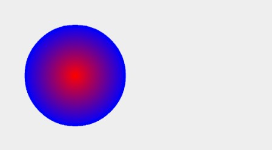
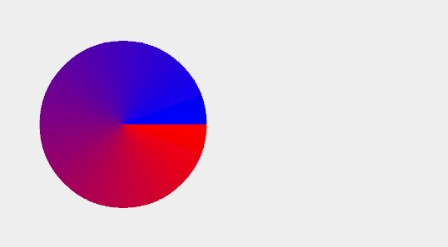

## Paint 画笔高级应用

### 概念

画笔，保存了绘制几何图形、文本和位图的样式和颜色信息

### 常用API

Paint 的 API 大致可以分为 4 类：

- 初始化
- 颜色
- 效果
- drawText() 相关

```
Paint mPaint = new Paint(); //初始化
mPaint.setColor(Color.RED);// 设置颜色
mPaint.setARGB(255, 255, 255, 0); // 设置 Paint对象颜色,范围为0~255
mPaint.setAlpha(200); // 设置alpha不透明度,范围为0~255
mPaint.setAntiAlias(true); // 设置是否抗锯齿效果

// 画笔样式
// Paint.Style.FILL：填充效果
// Paint.Style.STROKE：描边效果
// Paint.Style.FILL_AND_STROKE：两种效果同时存在
mPaint.setStyle(Paint.Style.FILL);
mPaint.setStrokeWidth(4); //画笔宽度

// 画笔线冒样式
// Paint.Cap.BUTT：无线冒，默认样式
// Paint.Cap.ROUND：圆形线冒
// Paint.Cap.SQUARE：方形线冒
mPaint.setStrokeCap(Paint.Cap.ROUND);

// 设置拐角的形状
// Paint.Join.MITER：尖角效果，默认效果
// Paint.Join.ROUND：圆角效果
// Paint.Join.BEVEL：平角效果
mPaint.setStrokeJoin(Paint.Join.MITER);
mPaint.setShader(new SweepGradient(200, 200, Color.BLUE, Color.RED)); //设置环形着色器
mPaint.setXfermode(new PorterDuffXfermode(PorterDuff.Mode.DARKEN)); //设置图层混合模式
mPaint.setColorFilter(new LightingColorFilter(0x00ffff, 0x000000)); //设置颜色过滤器
mPaint.setFilterBitmap(true); //设置双线性过滤
mPaint.setMaskFilter(new BlurMaskFilter(10, BlurMaskFilter.Blur.NORMAL));//设置画笔遮罩滤镜 ,传入度数和样式
mPaint.setTextScaleX(2);// 设置文本缩放倍数
mPaint.setTextSize(38);// 设置字体大小
mPaint.setTextAlign(Paint.Align.LEFT);//对其方式
mPaint.setUnderlineText(true);// 设置下划线

String str = "Paint画笔高级应用";
Rect rect = new Rect();
mPaint.getTextBounds(str, 0, str.length(), rect); //测量文本大小，将文本大小信息存放在rect中
mPaint.measureText(str); //获取文本的宽
mPaint.getFontMetrics(); //获取字体度量对象
```

### 1 初始化

#### 1.1 reset()

重置 Paint  的所有属性为默认值。相当于重新 new 一个，不过性能会高一些。

#### 1.2 set(Paint src)

把 src 的所有属性全部复制过来。相当于调用 src 所有的 get 方法，然后调用这个 Paint 的对应的 set 方法来设置它们。

#### 1.3 setFlags(int flags)

批量设置 flags。相当于依次调用它们的 set 方法。例如：

```
paint.setFlags(Paint.ANTI_ALIAS_FLAG | Paint.DITHER_FLAG); 
```

这行代码，和下面这两行是等价的：

```
paint.setAntiAlias(true);  
paint.setDither(true);  
setFlags(flags) 对应的 get 方法是 int getFlags()。
```

### 2 颜色

#### 2.1 setColor(int color)

```
mPaint.setColor(Color.RED);
canvas.drawRect(30, 30, 230, 180, paint);
```

#### 2.2 setARGB(int a, int r, int g, int b)

其实和 `setColor(color)` 都是一样一样儿的，只是它的参数用的是更直接的三原色与透明度的值。

```
mPaint.setARGB(255, 255, 0, 0);
```


#### 2.3 setShader(Shader shader) 

在 Android 的绘制里使用 Shader ，并不直接用 Shader 这个类，而是用它的几个子类。
- LinearGradient
- RadialGradient
- SweepGradient
- BitmapShader
- ComposeShader

##### 2.3.1 LinearGradient 线性渐变

构造方法：

```
/**
 * (x0, y0)：渐变起点坐标
 * (x1, y1)：渐变终点坐标
 * colors：渐变颜色数组，在第二个构造方法中，color0，color1分别表示起点和终点颜色值
 * positions[]：位置数组，position的取值范围为[0,1]，作用是指定某个位置的颜色值，可以为null
 * tile: 端点范围之外的着色规则，类型是 TileMode，一共有三个值：
 *       CLAMP：会在端点之外延续端点处的颜色；
 *       MIRROR：镜像模式；
 *       REPEAT：重复模式。
 */
LinearGradient(float x0, float y0, float x1, float y1, @NonNull @ColorInt int colors[],
            @Nullable float positions[], @NonNull TileMode tile)

LinearGradient(float x0, float y0, float x1, float y1, int color0, int color1, Shader.TileMode tile) 
```

使用：

```
Shader shader = new LinearGradient(100, 100, 500, 500, Color.RED, Color.BLUE,
                Shader.TileMode.CLAMP);
mPaint.setShader(shader);
```


##### 2.3.2 RadialGradient 辐射渐变

构造方法：

```
/**
 * (centerX, centerY)：辐射中心坐标
 * radius: 辐射半径
 * colors: 渐变颜色数组
 *         在第二个构造方法中,centerColor: 辐射中心颜色
 *                         edgeColor: 辐射边缘颜色
 * stops[]：位置数组，stop的取值范围为[0,1]，作用是指定某个位置的颜色值，可以为null
 * tile: 端点范围之外的着色规则，类型是 TileMode，一共有三个值：
 *       CLAMP：会在端点之外延续端点处的颜色；
 *       MIRROR：镜像模式；
 *       REPEAT：重复模式。
 */
RadialGradient(float centerX, float centerY, float radius,
        @NonNull @ColorInt int colors[], @Nullable float stops[],
        @NonNull TileMode tileMode)

RadialGradient(float centerX, float centerY, float radius,
        @ColorInt int centerColor, @ColorInt int edgeColor, @NonNull TileMode tileMode)
```

使用：

```
Shader shader = new RadialGradient(300, 300, 200, Color.RED, Color.BLUE,
            Shader.TileMode.CLAMP);
mPaint.setShader(shader);
```



##### 2.3.3 SweepGradient 扫描渐变

构造方法：

```
/**
 * (cx, cy)：扫描中心坐标
 * colors: 渐变颜色数组
 *         在第二个构造方法中,在第二个构造方法中，color0，color1分别表示扫描起点和终点颜色值
 * positions[]: 位置数组，position的取值范围为[0,1]，作用是指定某个位置的颜色值，可以为null
 */
SweepGradient(float cx, float cy,
        @NonNull @ColorInt int colors[], @Nullable float positions[])

SweepGradient(float cx, float cy, @ColorInt int color0, @ColorInt int color1)
```

使用：

```
Shader shader = new SweepGradient(300, 300, Color.RED, Color.BLUE);
mPaint.setShader(shader);
```



##### 2.3.4 BitmapShader 位图着色器

构造方法：

```
/**
 * bitmap: 扫描中心坐标
 * tileX: 横向的 TileMode 
 * tileY: 纵向的 TileMode 
 */
BitmapShader(@NonNull Bitmap bitmap, @NonNull TileMode tileX, @NonNull TileMode tileY)
```

使用：

```
Bitmap bitmap = BitmapFactory.decodeResource(getResources(), R.drawable.avatar);
Shader shader = new BitmapShader(bitmap, Shader.TileMode.CLAMP, Shader.TileMode.CLAMP);
mPaint.setShader(shader);
```


##### 2.3.5 ComposeShader 组合着色器

构造方法：

```
/**
 * shaderA, shaderB: 要组合使用的两个Shader 
 * PorterDuff.Mode mode: 组合两种shader颜色的模式
 * Xfermode mode: 组合两种shader颜色的模式
 */
ComposeShader(Shader shaderA, Shader shaderB, PorterDuff.Mode mode)

ComposeShader(Shader shaderA, Shader shaderB, Xfermode mode)
```

使用：

```
Shader linearShader = new LinearGradient(200, 200, 400, 400, Color.RED, Color.BLUE,
            Shader.TileMode.CLAMP);

Bitmap bitmap = BitmapFactory.decodeResource(getResources(), R.drawable.avatar);
Shader bitmapShader = new BitmapShader(bitmap, Shader.TileMode.CLAMP, Shader.TileMode.CLAMP);

Shader shader = new ComposeShader(linearShader, bitmapShader, PorterDuff.Mode.MULTIPLY);
mPaint.setShader(shader);
```


##### PorterDuff.Mode

[官方文档](https://developer.android.google.cn/reference/android/graphics/PorterDuff.Mode.html)

`PorterDuff.Mode` 是用来指定两个图像共同绘制时的颜色策略的。它是一个 enum，不同的 `Mode` 可以指定不同的策略。「颜色策略」的意思，就是说把源图像绘制到目标图像处时应该怎样确定二者结合后的颜色。

`PorterDuff.Mode` 在 `Paint` 一共有三处 API ，它们的工作原理都一样，只是用途不同：

| API                   | 用途                                         |
| --------------------- | :------------------------------------------- |
| ComposeShader         | 混合两个Shader                               |
| PorterDuffColorFilter | 增加一个单色的ColorFilter                    |
| Xfermode              | 设置绘制内容和 View 中已有内容的混合计算方式 |

具体来说， `PorterDuff.Mode` 一共有 18 个，可以分为两类：

1. Alpha 合成 (Alpha Compositing)
2. 混合 (Blending)

Alpha 合成：


混合：


#### 2.4 setColorFilter(ColorFilter colorFilter)

`ColorFilter` ：为绘制设置颜色过滤。就是为绘制的内容设置一个统一的过滤策略，然后 `Canvas.drawXXX()` 方法会对每个像素都进行过滤后再绘制出来。

在 `Paint` 里设置 `ColorFilter` ，使用的是 `Paint.setColorFilter(ColorFilter filter)` 方法。 `ColorFilter` 并不直接使用，而是使用它的子类。它共有三个子类：`LightingColorFilter` `PorterDuffColorFilter` 和 `ColorMatrixColorFilter`。

##### 2.4.1 LightingColorFilter

这个 `LightingColorFilter` 是用来模拟简单的光照效果的。

构造方法：

```
LightingColorFilter(int mul, int add)
```

参数：

参数里的 `mul` 和 `add` 都是和颜色值格式相同的 int 值，其中 `mul` 用来和目标像素相乘，`add` 用来和目标像素相加：

```
R' = R * mul.R / 0xff + add.R
G' = G * mul.G / 0xff + add.G
B' = B * mul.B / 0xff + add.B
```

一个「保持原样」的「基本 `LightingColorFilter` 」，`mul` 为 `0xffffff`，`add` 为 `0x000000`（也就是0），那么对于一个像素，它的计算过程就是：

```
R' = R * 0xff / 0xff + 0x0 = R // R' = R  
G' = G * 0xff / 0xff + 0x0 = G // G' = G  
B' = B * 0xff / 0xff + 0x0 = B // B' = B  
```

基于这个「基本 `LightingColorFilter` 」，你就可以修改一下做出其他的 filter。比如，如果你想去掉原像素中的红色，可以把它的 `mul` 改为 `0x00ffff` （红色部分为 0 ） ，那么它的计算过程就是：

```
R' = R * 0x00 / 0xff + 0x0 = 0 // 红色被移除  
G' = G * 0xff / 0xff + 0x0 = G  
B' = B * 0xff / 0xff + 0x0 = B  
```

具体效果是这样的：

```
ColorFilter lightingColorFilter = new LightingColorFilter(0x00ffff, 0x000000);  
paint.setColorFilter(lightingColorFilter);  
```


##### 2.4.2 PorterDuffColorFilter

使用一个指定的颜色和一种指定的 PorterDuff.Mode 来与绘制对象进行合成。

构造方法：

```
PorterDuffColorFilter(int color, PorterDuff.Mode mode)
```

参数：

color：具体的颜色值，例如Color.RED
mode：指定 PorterDuff.Mode 混合模式。

> 和 ComposeShader 不同的是，PorterDuffColorFilter 作为一个 ColorFilter，只能指定一种颜色作为源，而不是一个 Bitmap

使用：

```
ColorFilter filter = new PorterDuffColorFilter(Color.RED, PorterDuff.Mode.DARKEN);  
paint.setColorFilter(filter);  
```

##### 2.4.3 ColorMatrixColorFilter

构造方法：

```
ColorMatrixColorFilter(@NonNull ColorMatrix matrix)
ColorMatrixColorFilter(@NonNull float[] array)
```

参数：

`ColorMatrixColorFilter` 使用一个 `ColorMatrix` 来对颜色进行处理。 `ColorMatrix` 这个类，内部是一个 4x5 的矩阵：

```
[ a, b, c, d, e,
  f, g, h, i, j,
  k, l, m, n, o,
  p, q, r, s, t ]
```

通过计算， `ColorMatrix` 可以把要绘制的像素进行转换。对于颜色 [R, G, B, A] ，转换算法是这样的：

```
R’ = a*R + b*G + c*B + d*A + e;  
G’ = f*R + g*G + h*B + i*A + j;  
B’ = k*R + l*G + m*B + n*A + o;  
A’ = p*R + q*G + r*B + s*A + t;  
```

使用：

```
final float[] COMMON = {
	1, 0, 0, 0, 0,   // red
	0, 1, 0, 0, 0,   // green
	0, 0, 1, 0, 0,   // blue
	0, 0, 0, 1, 0    // alpha
};
ColorFilter colorFilter = new ColorMatrixColorFilter(COMMON);
mPaint.setColorFilter(colorFilter);
```

