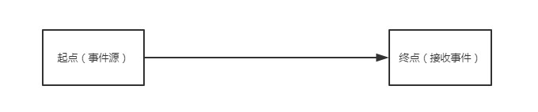
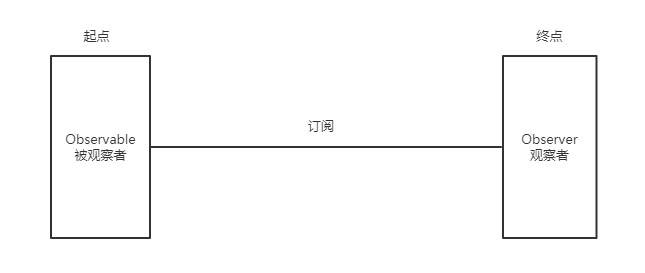
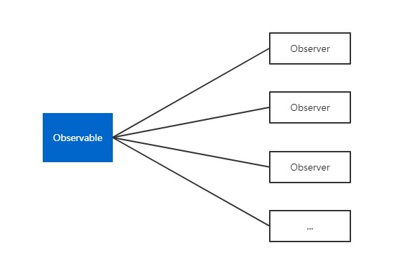

## RxJava初识

### 基于事件流编程



一切满足起点到终点的需求都可以使用RxJava来实现。



### 标准观察者模式



一个被观察者有多个观察者去观察，当一个被观察者产生一个事件，所有观察者接收到事件进行处理。例如换肤功能，当点击换肤按钮，会将所有需要换肤的控件进行换肤处理。

RxJava是改装的观察者设计模式，一个订阅（注册）一个观察者。

#### 代码实现

##### 1.被观察者接口

```java
/**
 * 被观察者标准
 */
public interface Observable {
    /**
     * 在被观察者中来注册观察者
     * @param observer 观察者对象
     */
    void registerObserver(Observer observer);

    /**
     * 在被观察者中移除观察者
     * @param observer 观察者对象
     */
    void removeObserver(Observer observer);

    /**
     * 通知所有注册的观察者
     */
    void notifyObservers();
}
```

##### 2.观察者接口

```java
/**
 * 观察者标准
 */
public interface Observer {
    /**
     * 接收到被观察者的消息进行处理
     * @param info
     * @param <T>
     */
    <T> void changeAction(T info);
}
```

##### 3.被观察者实现类

```java
/**
 * 被观察者实现类
 */
public class ObservableImpl implements Observable {
    // 观察者集合
    private List<Observer> mObserverList = new ArrayList<>();
    @Override
    public void registerObserver(Observer observer) {
        mObserverList.add(observer);
    }

    @Override
    public void removeObserver(Observer observer) {
        mObserverList.remove(observer);
    }

    @Override
    public void notifyObservers() {
        for (Observer observer : mObserverList) {
            // 在被观察者实现类中，通知所有注册好的观察者
            observer.changeAction("被观察者发生改变");
        }
    }
}
```

##### 4.观察者实现类

```java
/**
 * 观察者实现类
 */
public class ObserverImpl implements Observer {
    @Override
    public <T> void changeAction(T info) {
        System.out.println(info);
    }
}
```

##### 5.调用

```java
public class TestClient {

    public static void main(String[] args) {

        Observer observer_1 = new ObserverImpl(); // 警察1  - 观察者
        Observer observer_2 = new ObserverImpl(); // 警察2  - 观察者
        Observer observer_3 = new ObserverImpl(); // 警察3  - 观察者
        Observer observer_4 = new ObserverImpl(); // 警察4  - 观察者
        Observer observer_5 = new ObserverImpl(); // 警察5  - 观察者

        // 一个小偷  被观察者
        Observable observable = new ObservableImpl();

        // 关联 注册
        observable.registerObserver(observer_1);
        observable.registerObserver(observer_2);
        observable.registerObserver(observer_3);
        observable.registerObserver(observer_4);
        observable.registerObserver(observer_5);

        // 小偷发生改变(被观察者)
        observable.notifyObservers();
    }
}
```

### RxJava上游与下游

上游：Observable 被观察者
下游：Observer 观察者

```java
// 上游 Observable 被观察者
Observable observable = Observable.create(new ObservableOnSubscribe<Integer>() {
    /**
     * 发射器
     * @param emitter 事件
     */
    @Override
    public void subscribe(ObservableEmitter<Integer> emitter) throws Exception {
        Log.d(TAG, "上游subscribe: 发射事件");
        // 发射事件
        emitter.onNext(1);
        Log.d(TAG, "上游subscribe: 发射完成");
    }
});

// 下游 Observer 观察者
Observer<Integer> observer = new Observer<Integer>() {
    @Override
    public void onSubscribe(Disposable d) {

    }
    @Override
    public void onNext(Integer integer) {
        Log.d(TAG, "下游onNext: " + integer);
    }
    @Override
    public void onError(Throwable e) {

    }
    @Override
    public void onComplete() {

    }
};

// 订阅，被观察者订阅观察者
observable.subscribe(observer);
```

### RxJava流程

#### 正常流程

```java
Observable.create(new ObservableOnSubscribe<String>() {
    @Override
    public void subscribe(ObservableEmitter<String> emitter) throws Exception {
        Log.d(TAG, "上游 subscribe: 开始发射");
        emitter.onNext("发射事件");
        emitter.onComplete();
        Log.d(TAG, "上游 subscribe: 发射完成");
    }
}).subscribe(new Observer<String>() {
    @Override
    public void onSubscribe(Disposable d) {
        Log.d(TAG, "上游和下游订阅成功 onSubscribe 1");
    }

    @Override
    public void onNext(String s) {
        Log.d(TAG, "下游接收 onNext: " + s);
    }

    @Override
    public void onError(Throwable e) {

    }

    @Override
    public void onComplete() {
        Log.d(TAG, "下游接收完成 onComplete");
    }
});
```

```
D/fhj: 上游和下游订阅成功 onSubscribe 1
D/fhj: 上游 subscribe: 开始发射
D/fhj: 下游接收 onNext: 发射事件
D/fhj: 下游接收完成 onComplete
D/fhj: 上游 subscribe: 发射完成
```

1. 被观察者 `subscribe`（订阅）观察者，会执行 `onSubscribe()` 方法，表示订阅成功。
2. 被观察者中执行 `onNext()` 开始发射事件，观察者会执行 `onNext()` 方法接收到事件。
3. 被观察者中执行 `onComplete()` 方法，观察者中就会执行 `onComplete()` 方法表示接收完成

#### 其他结论

1. 在上游 `onComplete()` 发射完成之后再发送事件，下游不在接收到上游的事件。
2. 在上游 `onError()` 发射完成之后是在发送事件，和第一个结论。
3. 已经发射了 `onComplete()`， 再发射 `onError` RxJava会报错，不允许。先发射 `onError`，再 `onComplete()`，不会报错， 但是 `onComplete` 不会接收到了。

#### 切断下游

```java
Disposable d;

/**
 * 切断下游，让下游不再接收上游的事件，也就是说不会去更新UI
 * @param view
 */
public void r06(View view) {
    // TODO 上游 Observable
    Observable.create(new ObservableOnSubscribe<Integer>() {
        @Override
        public void subscribe(ObservableEmitter<Integer> e) throws Exception {
            for (int i = 0; i < 100; i++) {
                e.onNext(i);
            }
            e.onComplete();
        }
    })

    // 订阅下游
    .subscribe(new Observer<Integer>() {
        @Override
        public void onSubscribe(Disposable d) {
            MainActivity.this.d = d;
        }

        @Override
        public void onNext(Integer integer) {
            Log.d(TAG, "下游接收 onNext: " + integer);

            // 接收上游的一个事件之后，就切断下游，让下游不再接收
            // d.dispose();
        }

        @Override
        public void onError(Throwable e) {

        }

        @Override
        public void onComplete() {

        }
    });
}

@Override
protected void onDestroy() {
    super.onDestroy();
    // 切断下游
    if (d != null) d.dispose();
}
```