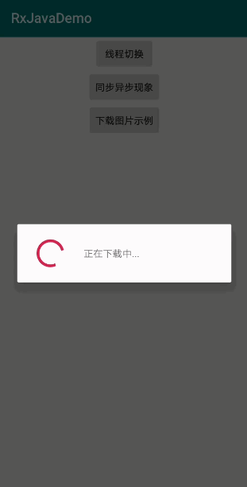

## RxJava线程切换

RxJava如果不配置，默认就是主线程。在实际运用中，比如点击下载按钮下载图片，下载完后显示图片。下载图片这种网络耗时操作必须在子线程中执行，界面显示图片必须在主线程中执行。所以需要进行线程切换。

### 简单线程切换

```java
Observable
        .create(new ObservableOnSubscribe<String>() {
            @Override
            public void subscribe(ObservableEmitter<String> emitter) throws Exception {
                Log.d(TAG, "上游所在线程: " + Thread.currentThread().getName());
                emitter.onNext("");
                emitter.onComplete();
            }
        })
        .subscribeOn(Schedulers.io()) // 给上游切换成异步线程
        .observeOn(AndroidSchedulers.mainThread())  // 给下游切换成主线程
        .subscribe(new Consumer<String>() {
            @Override
            public void accept(String s) throws Exception {
                Log.d(TAG, "下游所在线程: " + Thread.currentThread().getName());
            }
        });
```
```
D/fhj: 上游所在线程: RxCachedThreadScheduler-1
D/fhj: 下游所在线程: main
```

上游使用 subscribeOn() 切换线程，下游使用 observeOn() 切换线程

### 线程模式

1. Schedulers.io()： io流操作，网络操作，文件流，耗时操作等异步操作
2. Schedulers.newThread()：比较常规的异步线程
3. Schedulers.computation()：需要cpu大量计算的线程
4. AndroidSchedulers.mainThread()：专供android切换到主线程

以上4种模式，io()和mainThread()模式是比较常用的。下面代码测试上游和下游线程的切换

### 线程切换注意点

#### 多次切换

```java
Observable
        .create(new ObservableOnSubscribe<String>() {
            @Override
            public void subscribe(ObservableEmitter<String> emitter) throws Exception {
                Log.d(TAG, "上游所在线程: " + Thread.currentThread().getName());
                emitter.onNext("");
                emitter.onComplete();
            }
        })
        // 给上游切换线程时，切换多次，只会在第一次切换，后面的不切换了
        .subscribeOn(Schedulers.io()) // 给上游切换成异步线程
        .subscribeOn(Schedulers.newThread())
        .subscribeOn(Schedulers.computation())
        .subscribeOn(AndroidSchedulers.mainThread())

        // 给下游切换线程时，切换多次，每次都会去切换
        .observeOn(Schedulers.io())
        .observeOn(Schedulers.newThread())
        .observeOn(Schedulers.computation())
        .observeOn(AndroidSchedulers.mainThread()) // 给下游切换成主线程

        .subscribe(new Consumer<String>() {
            @Override
            public void accept(String s) throws Exception {
                Log.d(TAG, "下游所在线程: " + Thread.currentThread().getName());
            }
        });
```
```
D/fhj: 上游所在线程: RxCachedThreadScheduler-1
D/fhj: 下游所在线程: main
```

**总结**

- 给上游切换线程时，切换多次，只会在第一次切换，后面的不切换了
- 给下游切换线程时，切换多次，每次都会去切换

#### 同步异步现象

默认情况下，就是上游和下游都在主线程中。

上游发一次，下游接收一次，上游发一次，下游接收一次，上游发一次，下游接收一次。

```java
Observable.create(new ObservableOnSubscribe<Integer>() {
    @Override
    public void subscribe(ObservableEmitter<Integer> e) throws Exception {
        Log.d(TAG, "上游发送了一次 1 ");
        e.onNext(1);

        Log.d(TAG, "上游发送了一次 2 ");
        e.onNext(2);

        Log.d(TAG, "上游发送了一次 3 ");
        e.onNext(3);
    }
}).subscribe(new Consumer<Integer>() {
    @Override
    public void accept(Integer integer) throws Exception {
        Log.d(TAG, "下游接收: " + integer);
    }
});
```
```
D/fhj: 上游发送了一次 1 
D/fhj: 下游接收: 1
D/fhj: 上游发送了一次 2 
D/fhj: 下游接收: 2
D/fhj: 上游发送了一次 3 
D/fhj: 下游接收: 3
```

配置好异步线程，就是异步的表现

```java
Observable.create(new ObservableOnSubscribe<Integer>() {
    @Override
    public void subscribe(ObservableEmitter<Integer> e) throws Exception {
        Log.d(TAG, "subscribe: 上游发送了一次 1 ");
        e.onNext(1);

        Log.d(TAG, "subscribe: 上游发送了一次 2 ");
        e.onNext(2);

        Log.d(TAG, "subscribe: 上游发送了一次 3 ");
        e.onNext(3);
    }
}).subscribeOn(Schedulers.io()) // 给上游分配 异步线程
  .observeOn(AndroidSchedulers.mainThread()) // 给下游分配 主线程

  .subscribe(new Consumer<Integer>() {
    @Override
    public void accept(Integer integer) throws Exception {
        Log.d(TAG, "下游 accept: " + integer);
    }
});

```
```
D/fhj: subscribe: 上游发送了一次 1 
D/fhj: subscribe: 上游发送了一次 2 
D/fhj: subscribe: 上游发送了一次 3 
D/fhj: 下游 accept: 1
D/fhj: 下游 accept: 2
D/fhj: 下游 accept: 3
```

### 实例

例如一个需求：网络上下载一张图片，然后显示在界面上。常规的做法可能就是开一个子线程负责网络图片的下载，得到图片后，通过Handler发送到UI线程进行界面的更新。这样写，当然也没有问题，但是，这样会显得代码四分五裂，可读性不是很强。但是通过rxjava的链式调用以及线程切换，这样的需求同样能够实现，并且代码的阅读性很强。


#### 示例代码

```java
 private final String PATH = "http://photocdn.sohu.com/20120625/Img346436473.jpg";

public void download(View view) {
    Observable.just(PATH)
            .map(new Function<String, Bitmap>() {
                @Override
                public Bitmap apply(String s) throws Exception {
                    return requstDownload(s);
                }
            })
            .subscribeOn(Schedulers.io())
            .observeOn(AndroidSchedulers.mainThread())
            .subscribe(new Observer<Bitmap>() {
                @Override
                public void onSubscribe(Disposable d) {
                    progressDialog = new ProgressDialog(RxJavaSchedulersActivity.this);
                    progressDialog.setMessage("正在下载中...");
                    progressDialog.show();
                }

                @Override
                public void onNext(Bitmap bitmap) {
                    imageView.setImageBitmap(bitmap);
                }

                @Override
                public void onError(Throwable e) {
                    Log.d(TAG, "onError: "+e.getMessage());
                }

                @Override
                public void onComplete() {
                    Log.d(TAG, "onComplete: ");
                    if(progressDialog != null) progressDialog.dismiss();
                }
            });
}

private Bitmap requstDownload(String path) {
    try {
        URL url = new URL(path);
        URLConnection urlConnection = url.openConnection();
        HttpURLConnection httpURLConnection = (HttpURLConnection) urlConnection;
        httpURLConnection.setConnectTimeout(5000);
        int responseCode = httpURLConnection.getResponseCode();
        if (HttpURLConnection.HTTP_OK == responseCode) {
            Bitmap bitmap = BitmapFactory.decodeStream(httpURLConnection.getInputStream());
            return bitmap;
        }
    } catch (Exception e) {
        e.printStackTrace();
        Log.d(TAG, "requstDownload: "+e);
    }
    return null;
}
```

#### 增加对图片变化操作

比如需要对下载图片加一个自己的水印，只要通过RxJava的操作符来操作就很方便。

```java
.map(new Function<Bitmap, Bitmap>() {
    @Override
    public Bitmap apply(Bitmap bitmap) throws Exception {
        // 给图片加水印
        Paint paint = new Paint();
        paint.setColor(Color.RED);
        paint.setTextSize(30);
        Bitmap bitmapSuccess = drawTextToBitmap(bitmap, "RxJavaDemo", paint, 60, 60);
        return bitmapSuccess;
    }
})

//图片上绘制文字
private Bitmap drawTextToBitmap(Bitmap bitmap, String text, Paint paint, int paddingLeft, int paddingTop) {
    Bitmap.Config bitmapConfig = bitmap.getConfig();

    paint.setDither(true); // 获取跟清晰的图像采样
    paint.setFilterBitmap(true);// 过滤一些
    if (bitmapConfig == null) {
        bitmapConfig = Bitmap.Config.ARGB_8888;
    }
    bitmap = bitmap.copy(bitmapConfig, true);
    Canvas canvas = new Canvas(bitmap);

    canvas.drawText(text, paddingLeft, paddingTop, paint);
    return bitmap;
}
```

#### 效果

