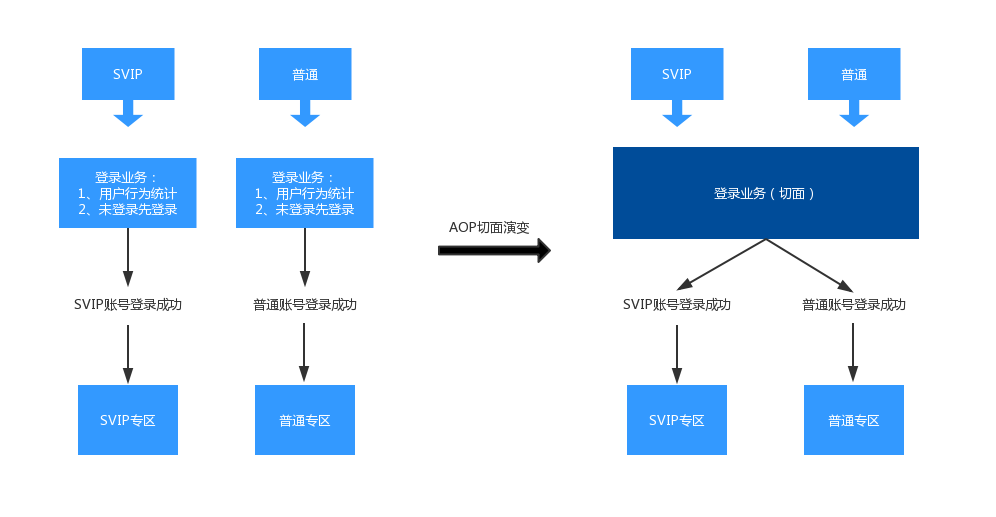

## AOP面向切面之集中式登录架构设计

### 架构设计

在app应用场景中，登录模块是个全局的模块，比如app中有svip和普通用户区分，那么对应所能使用的功能也是不一样的，但是有个共同点就是必须先登录，所以就可以将整个登录业务设计成一个切面。



这里使用 AspectJ 来设计开发。

### AspectJ简单介绍

AspectJ是一个面向切面的框架，它扩展了Java语言。AspectJ定义了AOP语法，它有一个专门的编译器用来生成遵守Java字节编码规范的Class文件。

**Aspect**：Aspect 声明类似于 Java 中的 类声明 ，在Aspect中会包含着一些 Pointcut (切入点)以及相应的 Advice (通知) , 「Pointcut 和 Advice 的组合可以看做切面」

**Advice**：( 通知 ) , 定义了在 Pointcut 里面定义的程序点具体要做的操作，它通过 before、after 和 around 来区别是在每个JoinPoint (连接点)之前、之后还是完全替代目标方法 的代码。

**Pointcut**：( 切入点 ) , 告诉代码注入工具，在何处注入一段特定代码的表达式。

**JoinPoint**：( 连接点) , 表示 aspectj 支持代码织入的位置 ，例如典型的 方法函数调用 ， 类成员的访问 以及对 异常处理程序块 的执行等等，这些都是 JPoint 。(如Log.e()这个函数 , e()可以看作是个 JPoint ，而且调用e()的函数也可以认为是一个 JPoint ) , 也就是所有可以注入代码的地方。

### 代码实现

#### 1. 配置依赖

build.gradle(project)

```groovy
buildscript {
    ...
    dependencies {
        ...
        // 版本界限：As-3.0.1 + gradle4.4-all （需要配置r17的NDK环境）
        // 或者：As-3.2.1 + gradle4.6-all （正常使用，无警告）
        classpath 'org.aspectj:aspectjtools:1.8.9'
        classpath 'org.aspectj:aspectjweaver:1.8.9'
    }
}
```

build.gradle(Module:app)

```groovy
// 版本界限：As-3.0.1 + gradle4.4-all （需要配置r17的NDK环境）
// 或者：As-3.2.1 + gradle4.6-all （正常使用，无警告）
buildscript { // 编译时用Aspect专门的编译器，不再使用传统的javac
    repositories {
        mavenCentral()
    }
    dependencies {
        classpath 'org.aspectj:aspectjtools:1.8.9'
        classpath 'org.aspectj:aspectjweaver:1.8.9'
    }
}

dependencies {
    implementation 'org.aspectj:aspectjrt:1.8.13'
}

import org.aspectj.bridge.IMessage
import org.aspectj.bridge.MessageHandler
import org.aspectj.tools.ajc.Main

final def log = project.logger
final def variants = project.android.applicationVariants

variants.all { variant ->
    if (!variant.buildType.isDebuggable()) {
        log.debug("Skipping non-debuggable build type '${variant.buildType.name}'.")
        return;
    }

    JavaCompile javaCompile = variant.javaCompile
    javaCompile.doLast {
        String[] args = ["-showWeaveInfo",
                         "-1.8",
                         "-inpath", javaCompile.destinationDir.toString(),
                         "-aspectpath", javaCompile.classpath.asPath,
                         "-d", javaCompile.destinationDir.toString(),
                         "-classpath", javaCompile.classpath.asPath,
                         "-bootclasspath", project.android.bootClasspath.join(File.pathSeparator)]
        log.debug "ajc args: " + Arrays.toString(args)

        MessageHandler handler = new MessageHandler(true);
        new Main().run(args, handler);
        for (IMessage message : handler.getMessages(null, true)) {
            switch (message.getKind()) {
                case IMessage.ABORT:
                case IMessage.ERROR:
                case IMessage.FAIL:
                    log.error message.message, message.thrown
                    break;
                case IMessage.WARNING:
                    log.warn message.message, message.thrown
                    break;
                case IMessage.INFO:
                    log.info message.message, message.thrown
                    break;
                case IMessage.DEBUG:
                    log.debug message.message, message.thrown
                    break;
            }
        }
    }
}
```

#### 2. 创建自定义注解行为

```java
// 是否登录检查
@Target(ElementType.METHOD)
@Retention(RetentionPolicy.RUNTIME)
public @interface LoginCheck {
}
```

#### 3. 调用注解方法

```java
@LoginCheck
public void area(View view) {
    Log.e(TAG, "开始跳转到 -> 我的专区 Activity");
    startActivity(new Intent(this, OtherActivity.class));
}

@LoginCheck
public void coupon(View view) {
    Log.e(TAG, "开始跳转到 -> 我的优惠券 Activity");
    startActivity(new Intent(this, OtherActivity.class));
}

@LoginCheck
public void score(View view) {
    Log.e(TAG, "开始跳转到 -> 我的积分 Activity");
    startActivity(new Intent(this, OtherActivity.class));
}  
```

#### 4. 声明使用 Aspect 的类

```java
@Aspect // 定义一个切面类
public class LoginCheckAscept {
    private final static String TAG = "fhj >>> ";

    // 1、应用中用到了那些注解，放到当前的切入点进行处理（找到需要处理的切入点）
    // execution，以方法执行时作为切点，触发Aspect类
    // * *(..)) 可以处理ClickBehavior这个类所有的方法
    @Pointcut("execution(@com.vergo.demo.aop.login.annotation.LoginCheck * *(..))")
    public void pointcut() { }

    // 2、对切入点如何处理
    @Around("pointcut()")
    public Object joinPoint(ProceedingJoinPoint joinPoint) throws Throwable {
        Context context = (Context) joinPoint.getThis();
        SharedPreferences sharedPreferences = context.getSharedPreferences("login", Context.MODE_PRIVATE);
        boolean isLogin = sharedPreferences.getBoolean("isLogin", false);
        if(isLogin) {
            Log.e(TAG, "检测到已登录！");
            return joinPoint.proceed();
        } else {
            Log.e(TAG, "检测到未登录！");
            context.startActivity(new Intent(context, LoginActivity.class));
            return null;
        }
    }
}
```

#### 4. 运行效果

未登录时

```
E/fhj >>>: 检测到未登录！
```

已登录时

```
E/fhj >>>: 检测到已登录！
E/fhj >>>: 开始跳转到 -> 我的专区 Activity
```