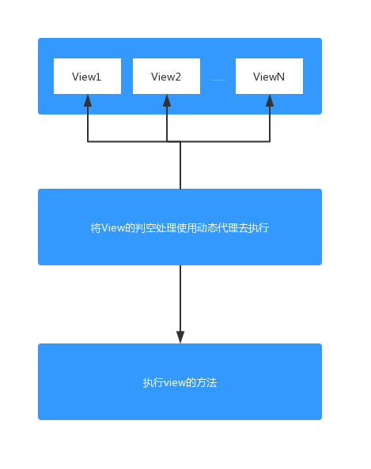
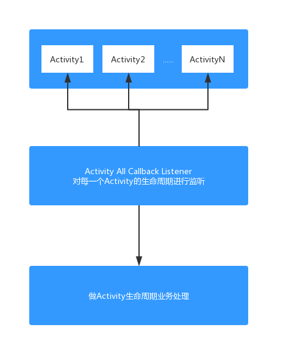

## AOP面向切面架构设计

### 什么是AOP？

通过预编译的方式和运行时动态代理来实现程序的功能，统一维护的一种技术。

### AOP设计方式

#### 第一种方式-动态代理

例如有很多的View控件，开发中需要对每个控件进行判空处理，当View控件不等于空的时候，才能调用该控件的方法。



#### 第二种方式-预编译



### 理解切面

面向切面指的绝大部分是横向切面，把相同的业务功能抽取出来，做成一个切面。

AOP本质就是在一系列纵向业务流程中，把那些有相同业务的子流程抽取成一个横向的面。

### 动态代理切面需求实例

以对本地数据库进行增、删、改操作为实例，在每一次操作前，都要做一次数据的备份。

那么以AOP的思想来做，对数据库的这些操作都有一个共同的业务就是对数据进行备份，则可以在运行时通过动态代理方式去执行数据备份操作。

代码实现

1、定义数据库操作接口类

```java
public interface IDbOperation {
    void insert();
    void delete();
    void update();

    // 数据备份
    void backup();
}
```

2、Activity中实现操作接口

```java
public class DbActivity extends AppCompatActivity implements IDbOperation{
    @Override
    protected void onCreate(Bundle savedInstanceState) {
        super.onCreate(savedInstanceState);
        setContentView(R.layout.activity_main);
    }

    @Override
    public void insert() {
        Log.e("fhj", "新增数据");
    }

    @Override
    public void delete() {
        Log.e("fhj", "删除数据");
    }

    @Override
    public void update() {
        Log.e("fhj", "修改数据");
    }

    @Override
    public void backup() {
        Log.e("fhj", "保存数据");
    }
}
```

3、动态代理执行备份方法

```java
public class DbHandler implements InvocationHandler {

    private IDbOperation mDbOperation;

    public DbHandler(IDbOperation dbOperation) {
        mDbOperation = dbOperation;
    }

    @Override
    public Object invoke(Object proxy, Method method, Object[] args) throws Throwable {
        if(mDbOperation != null) {
            Log.e("fhj", "操作数据库之前，进行数据备份...");
            mDbOperation.backup();
            Log.e("fhj", "数据备份完成，进行其他操作");
            return method.invoke(mDbOperation, args);
        }
        return null;
    }
}
```

```java
private IDbOperation iDbOperation;

@Override
protected void onCreate(Bundle savedInstanceState) {
    super.onCreate(savedInstanceState);
    setContentView(R.layout.activity_main);

    iDbOperation = (IDbOperation) Proxy.newProxyInstance(IDbOperation.class.getClassLoader(),
                new Class[]{IDbOperation.class}, new DbHandler(this));
}
```

4、执行增删改方法

```java
public void insert(View view) {
    iDbOperation.insert();
}
...其余方法省略...
```

5、执行结果

```
E/fhj: 操作数据库之前，进行数据备份...
E/fhj: 保存数据
E/fhj: 数据备份完成，进行其他操作
E/fhj: 新增数据
```


