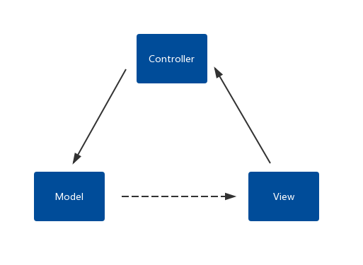
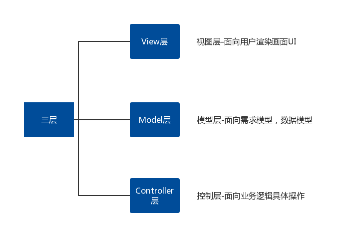
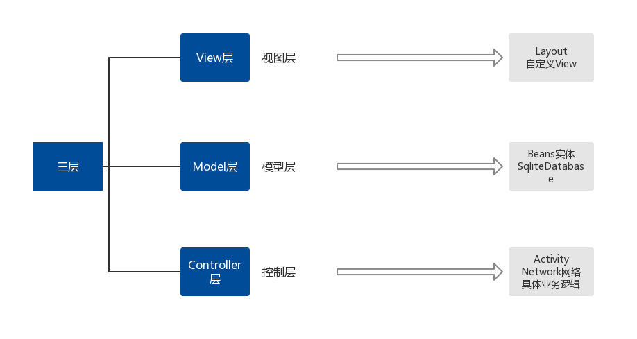

## MVC架构设计与三层模型

### MVC架构设计



MVC流程关系：

- View接收到用户的操作
- View将用户的操作，交个Controller
- Controller完成具体业务逻辑
- 得到结果封装Model，再进行View更新

Controller是作为一个媒介，处于Model和View之间。Model和View之间有紧密的联系，耦合性极强。

### 经典的三层模型



### 三层模型在Android中的体现



### 简单实例

以加载图片为例

#### View层

```xml
<RelativeLayout xmlns:android="http://schemas.android.com/apk/res/android"
                xmlns:tools="http://schemas.android.com/tools"
                android:layout_width="match_parent"
                android:layout_height="match_parent"
                tools:context=".MainActivity">

    <Button
        android:id="@+id/bt_get_image"
        android:layout_width="wrap_content"
        android:layout_height="wrap_content"
        android:onClick="getImage"
        android:text="获取图片"/>

    <ImageView
        android:id="@+id/iv_image"
        android:layout_width="wrap_content"
        android:layout_height="wrap_content"
        android:layout_below="@id/bt_get_image"/>

</RelativeLayout>
```

### Model层

```java
public class ImageBean {
    // 网络图片地址
    private String requestPath;

    // 结果返回bitmap对象
    private Bitmap bitmap;

    public String getRequestPath() {
        return requestPath;
    }

    public void setRequestPath(String requestPath) {
        this.requestPath = requestPath;
    }

    public Bitmap getBitmap() {
        return bitmap;
    }

    public void setBitmap(Bitmap bitmap) {
        this.bitmap = bitmap;
    }
}
```

### Controller层

下载回调接口

```java
public interface ICallback {
    /**
     * @param resultCode 请求结果返回标识码
     * @param imageBean Model层数据中bitmap对象（用于C层刷新V）
     */
    void callback(int resultCode, ImageBean imageBean);

}
```

下载方法

```java
public class ImageDownloader {

    // 成功
    static final int SUCCESS = 200;

    // 失败
    static final int ERROR = 404;

    public void down(ICallback callback, ImageBean imageBean) {
        new Thread(new DownLoader(callback, imageBean)).start();
    }

    static final class DownLoader implements Runnable {

        private final ICallback callback;
        private final ImageBean imageBean;

        public DownLoader(ICallback callback, ImageBean imageBean) {
            this.callback = callback;
            this.imageBean = imageBean;
        }

        @Override
        public void run() {
            try {
                URL url = new URL(imageBean.getRequestPath());
                HttpURLConnection httpURLConnection = (HttpURLConnection) url.openConnection();
                httpURLConnection.setConnectTimeout(5000);
                httpURLConnection.setRequestMethod("GET");

                if (httpURLConnection.getResponseCode() == HttpURLConnection.HTTP_OK) {
                    InputStream inputStream = httpURLConnection.getInputStream();
                    Bitmap bitmap = BitmapFactory.decodeStream(inputStream);
                    showUi(SUCCESS, bitmap);
                } else {
                    showUi(ERROR, null);
                }
            } catch (Exception e) {
                e.printStackTrace();
                showUi(ERROR, null);
            }
        }

        private void showUi(int resultCode, Bitmap bitmap) {
            if (callback != null) {
                imageBean.setBitmap(bitmap);
                callback.callback(resultCode, imageBean);
            }
        }
    }
}
```

调用

```java
public class MainActivity extends AppCompatActivity implements ICallback {

    private ImageView mImageView;
    private final static String PATH= "http://cmonbaby.com/content/templates/ek_auto/style/images/qrcode.png";

    private MyHandler mHandler;

    @Override
    protected void onCreate(Bundle savedInstanceState) {
        super.onCreate(savedInstanceState);
        setContentView(R.layout.activity_main);

        mImageView = findViewById(R.id.iv_image);
        mHandler = new MyHandler(this);
    }

    /**
     * 点击下载图片并加载
     * @param view
     */
    public void getImage(View view) {
        ImageBean imageBean = new ImageBean();
        imageBean.setRequestPath(PATH);
        new ImageDownloader().down(this, imageBean);
    }

    @Override
    public void callback(int resultCode, ImageBean imageBean) {
        // 下载回调
        Message message = mHandler.obtainMessage(resultCode);
        message.obj = imageBean.getBitmap();
        mHandler.sendMessageDelayed(message, 500);
    }

    private static class MyHandler extends Handler {
        private WeakReference<MainActivity> mActivity;

        private MyHandler(MainActivity activity) {
            mActivity = new WeakReference<>(activity);
        }
        @Override
        public void handleMessage(Message msg) {
            super.handleMessage(msg);

            switch (msg.what) {
                case ImageDownloader.SUCCESS: // 成功
                    mActivity.get().mImageView.setImageBitmap((Bitmap) msg.obj);
                    break;

                case ImageDownloader.ERROR: // 失败
                    Toast.makeText(mActivity.get(), "下载失败", Toast.LENGTH_SHORT).show();
                    break;
            }
        }
    }
}
```