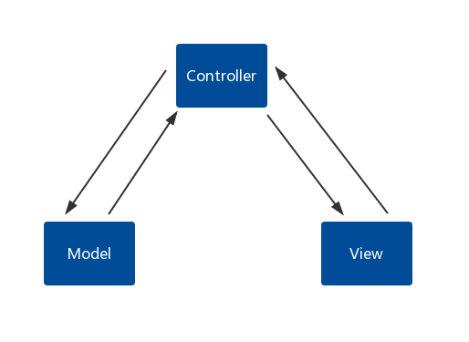
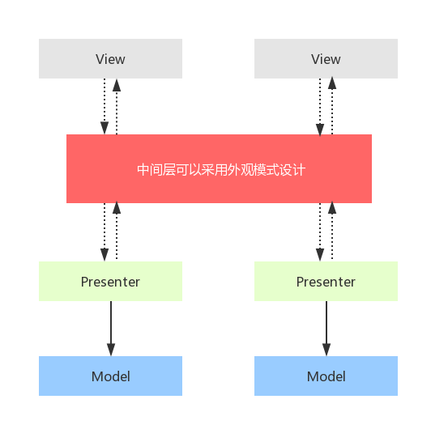
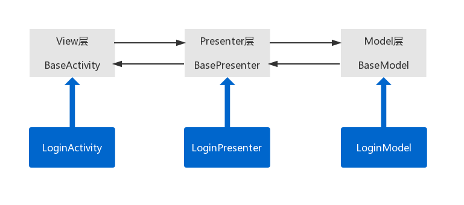

## MVP架构设计

### MVP初探

#### 关系：

- View收到用户的操作（与MVC的区别，Activity是View层）
- View把用户的操作，交给Presenter
- Presenter控制Model进行业务逻辑处理
- Presenter处理完毕后，数据封装到Model
- Presenter收到通知后，在更新View

#### 方式：

是双向的通信方式

#### 优点：

- View层与Model层完全分离
- 所有逻辑交互都在Presenter
- MVP分层较为严谨

### MVP思想精髓

- View层只需面向Presenter层，不需要知道Model层
- Model层只需面向Presenter层，不需要知道View层
- View层和Model层逻辑交互在Presenter

### 巧妙解耦View与Model

### MVP基础框架搭建

以登录模块为例

1. 收到用户请求，给P层
2. 校验请求信息后，操作M层
3. 请求服务器登录业务
4. 把结果数据通知给P层
5. 解析结果数据，处理后给V层
6. 更新UI

