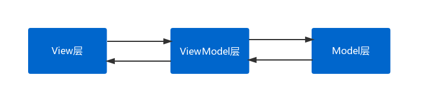

## MVVM架构设计

### 原理



### 优点

- 降低耦合：一个ViewModel层可以绑定不同的View层，当Model变化时View可以不变
- 可重用性：可以把一些视图逻辑放在ViewModel层中，让很多View重用这些视图逻辑

### 编译时绑定布局与对象

#### 第一步

在对应模块（Module）的build.gradle中添加

```groovy
android {
    ...
    dataBinding {
        enabled = true
    }
}
```

#### 第二步

建立一个java bean

```java
public class UserBean {
    private String name;
    private int age;

    public String getName() {
        return name;
    }

    public void setName(String name) {
        this.name = name;
    }

    public int getAge() {
        return age;
    }

    public void setAge(int age) {
        this.age = age;
    }
}
```

#### 第三步

1、xml布局最外层需用 <layout> 嵌套起来

2、配置 data->variable 信息

3、需要使用 data->variable->name标识.成员属性

格式：@{标识.成员属性}、@{String.valueOf(标识.成员属性)}、@{标识}

```xml
<?xml version="1.0" encoding="utf-8"?>
<layout xmlns:android="http://schemas.android.com/apk/res/android">

    <!-- 定义该布局需要绑定的数据名称和类型 -->
    <data>
        <variable
            name="User"
            type="com.vergo.demo.mvvm.model.UserBean"/>
    </data>

    <!-- 下部分内容和平时布局文件一样 -->
    <LinearLayout
        android:layout_width="match_parent"
        android:layout_height="match_parent"
        android:orientation="vertical">

        <TextView
            android:layout_width="match_parent"
            android:layout_height="wrap_content"
            android:layout_margin="20dp"
            android:text="@{User.name}"/>

        <TextView
            android:layout_width="match_parent"
            android:layout_height="wrap_content"
            android:layout_margin="20dp"
            android:text="@{String.valueOf(User.age)}"/>

    </LinearLayout>
</layout>
```

#### 第四步

数据绑定

```java
ActivityMainBinding activityMainBinding = DataBindingUtil.setContentView(this, R.layout.activity_main);

UserBean userBean = new UserBean("小明", 18);
activityMainBinding.setUser(userBean);

userBean.setAge(20);
```

