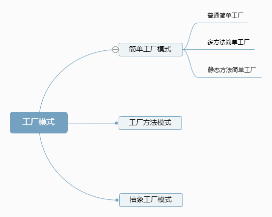

## 设计模式

### 1. 工厂模式



#### 1.1 简单工厂模式

就是建立一个工厂类，对实现了同一接口的一些类进行实例的创建。

核心：提供一个创建对象的功能，不需要关心具体实现

举个获取学校中个人信息

（1）创建获取个人信息共同接口

```java
public interface IPerson {
    PersonBean getPersonInfo();
}
```

（2）教师实现类

```java
public class TeacherImpl implements IPerson {
    @Override
    public PersonBean getPersonInfo() {
        PersonBean personBean = new PersonBean("冯老师");
        Log.v("fhj", "teacher>>>"+personBean.toString());
        return personBean;
    }
}
```

（3）学生实现类

```java
public class StudentImpl implements IPerson {
    @Override
    public PersonBean getPersonInfo() {
        PersonBean personBean = new PersonBean("小明", 18);
        Log.v("fhj", "student>>>"+personBean.toString());
        return personBean;
    }
}
```

（4）创建个人工厂类

```java
public class ParameterFactory {
    /**
     * 根据人的类型获取不同的实现
     * @param personType 人的类型
     */
    public static IPerson getPerson(int personType) {
        switch (personType) {
            case 1:
                return new TeacherImpl();
            case 2:
                return new StudentImpl();
        }
        return null;
    }
}
```

（5）调用

```java
IPerson teacherPerson = ParameterFactory.getPerson(1);
if(teacherPerson != null) teacherPerson.getPersonInfo();

IPerson studentPerson = ParameterFactory.getPerson(2);
if(studentPerson != null) studentPerson.getPersonInfo();
```

输出

```
V/fhj: teacher>>>PersonBean{name='冯老师', age=0}
V/fhj: student>>>PersonBean{name='小明', age=18}
```

### 2. 外观模式

#### 概念

隐藏了系统的复杂性，为子系统中的一组接口提供了一个统一的访问接口，这个接口使得子系统更容易被访问或者使用。 

#### 使用场景

1. 为复杂的模块或子系统提供外界访问的模块；

2. 子系统相互独立；

3. 在层析结构中，可以使用外观模式定义系统的每一层的入口。

#### 实例

以图片加载为例，图片加载先从内存中寻找图片，如果没有再从磁盘中寻找，找不到最后通过网络来加载。

代码实现

定义内存查找，磁盘查找，网络加载接口类

```java
public interface MemoryCache {
    Bitmap findBitmapFromMemory(String url);
}

public interface DiskCache {
    Bitmap findBitmapFromDisk(String url);
}

public interface NetworkLoader {
    Bitmap loaderFromNetwork(String url);
}
```

接口实现类

```java
public class MemoryCacheImpl implements MemoryCache {
    @Override
    public Bitmap findBitmapFromMemory(String url) {
        System.out.println("通过图片url，寻找内存中缓存的图片");
        return null;
    }
}

public class DiskCacheImpl implements DiskCache {
    @Override
    public Bitmap findBitmapFromDisk(String url) {
        System.out.println("通过图片url，寻找磁盘中缓存的图片");
        return null;
    }
}

public class NetwokLoaderImpl implements NetworkLoader {
    @Override
    public Bitmap loaderFromNetwork(String url) {
        System.out.println("通过图片url，通过网络加载图片");
        return null;
    }
}
```

定义外观门面类

```java
public class ImageLoader {

    private String url;
    private MemoryCache memoryCache;
    private DiskCache diskCache;
    private NetworkLoader networkLoader;

    public ImageLoader(String url) {
        this.url = url;
        memoryCache = new MemoryCacheImpl();
        diskCache = new DiskCacheImpl();
        networkLoader = new NetwokLoaderImpl();
    }

    public void loader() {
        memoryCache.findBitmapFromMemory(url);
        diskCache.findBitmapFromDisk(url);
        networkLoader.loaderFromNetwork(url);
    }
}
```

调用图片加载

```java
public class FacadeActivityTest {

    private final String url = "http://xxxxxx";
    @Test
    public void onCreate() {
        // 常规写法
//        MemoryCache memoryCache = new MemoryCacheImpl();
//        memoryCache.findBitmapFromMemory(url);
//
//        DiskCache diskCache = new DiskCacheImpl();
//        diskCache.findBitmapFromDisk(url);
//
//        NetworkLoader networkLoader = new NetwokLoaderImpl();
//        networkLoader.loaderFromNetwork(url);

        // 外观模式
        ImageLoader imageLoader = new ImageLoader(url);
        imageLoader.loader();
    }
}
```

输出

```
通过图片url，寻找内存中缓存的图片
通过图片url，寻找磁盘中缓存的图片
通过图片url，通过网络加载图片
```

#### 优点

- 松散耦合

    使得客户端和子系统之间解耦，让子系统内部的模块功能更容易扩展和维护；

- 简单易用

    客户端根本不需要知道子系统内部的实现，或者根本不需要知道子系统内部的构成，它只需要跟Facade类交互即可。

- 更好的划分访问层次

    有些方法是对系统外的，有些方法是系统内部相互交互的使用的。子系统把那些暴露给外部的功能集中到门面中，这样就可以实现客户端的使用，很好的隐藏了子系统内部的细节。
    
### 3. 适配器模式

#### 概念

适配器模式把一种接口变换成客户端所期待的另一种接口，从而使原本因接口不匹配而无法在一起工作的两个类能够在一起工作。

